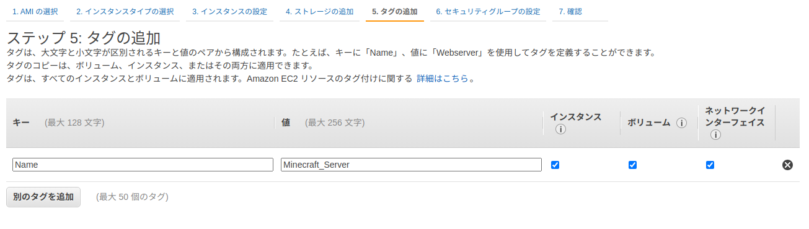
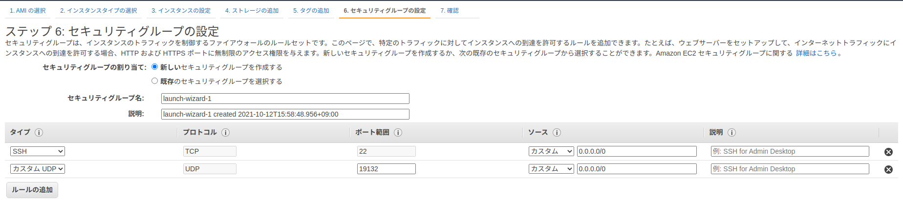
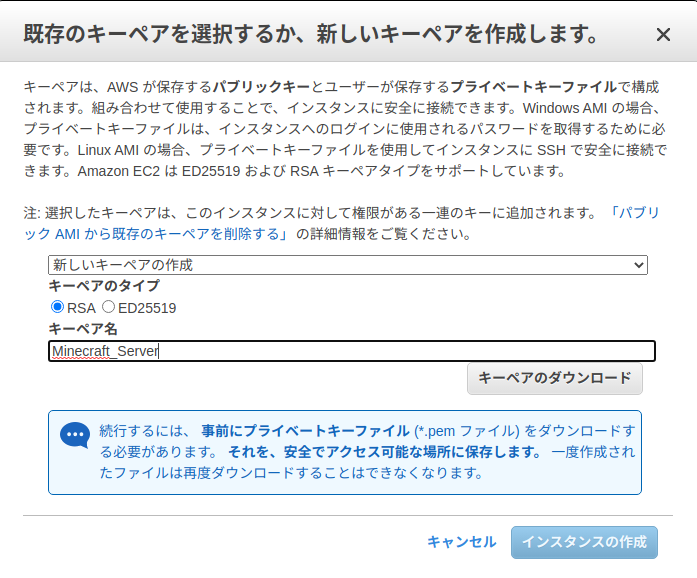

# マインクラフトサーバー立ち上げ手順

## AWSでインスタンスの作成

1. AWS
	1. awsと検索し[公式サイト](https://aws.amazon.com/jp/)を開く
	1. コンソールにサインイン(アカウントを持っていない方は[こちら](https://www.google.com/aclk?sa=L&ai=DChcSEwiz9522lMTzAhUGWmAKHV5OBrkYABAAGgJ0bQ&ae=2&sig=AOD64_0zbeTptPLVqLsFcfy3uqOIOcXySw&q&adurl&ved=2ahUKEwigqpi2lMTzAhUEGqYKHV9TCoQQ0Qx6BAgCEAE)から作成してログイン)
	1. EC2と検索を掛けて**EC2**を開く
1. インスタンスの作成
	1. 左側のメニューから**インスタンス**に移動
	1. ｢**インスタンスを起動**｣をクリック
		1. OSを選択する画面が出るので｢**Ubuntu Server 20.04**｣を選択
		1. インスタンスタイプの選択は今回は｢**t2.micro**｣で次のステップへ
		1. インスタンスの詳細設定は今回変更しないので次のステップへ
		1. ストレージの追加も今回はそのままで大丈夫なので次のステップへ
		1.step5のタグの追加でタグを追加します｡
			1. ｢**別のタグを追加**｣からタグを追加出来ます｡(今回はキーは｢**Name**｣､値は｢**Minecraft_Server**｣とします｡
			
		1. セキュリティグールプの設定で､ルールの追加をします｡
			1. タイプは**カスタムUDP**にします｡
			1. ポート範囲を**19132**にします｡
			1. ソースを**0.0.0.0/0**にします｡
			
			上記ができましたら｢確認と作成ボタン｣をクリックします｡
		1. 確認画面で上記の内容が反映されているかを確認してください｡  
		(画像で確認したい方は[こちら](./../images/InstansSettingCheck.png))
		確認ができましたら｢**起動**｣をクリック
		1. 既存のキーペアを使うか､新しいキーペアを作成するか聞かれるので今回は新しいキーペアを作ります｡  
		**こちらのキーペアの作成及びダウンロードは後々重要になりますので必ずしてください｡**
			1. 最初の選択項目の中から｢**新しいキーペアの作成**｣を選択
			1. キーペアのタイプはそのままで大丈夫です｡
			1. キーペア名は｢**Minecraft_Server**｣にします｡
			1. 上記ができましたら｢**キーペアのダウンロード**｣をクリックします｡
			1. キーペアのダウンロードが完了しましたら｢**インスタンスの作成**｣を押します
			
		1. これでインスタンスの作成が出来ました｡｢**インスタンスの表示**｣で最初の画面に戻れます｡
1. Elastic IPを取得し､インスタンスと関連付ける

<!--- HostOS --->
## Host_OS

1. mkdir (サーバーを作りたい場所)
1. cd Downloads
1. mv (鍵の名前) ../(サーバーを作りたい場所)
1. cd ../(サーバーを作りたい場所)
1. chmod 700 (鍵の名前)
1. ssh -i (鍵の名前) ubuntu@(サーバーの*パブリック*IPアドレスかDNS)

<!--- ここからはserver側 --->
## Server

1. mkdir (ubuntuで作ったファイル)
1. cd (ubuntuで作ったファイル)
1. https://www.minecraft.net/ja-jp/download/server/bedrock を調べてもらう
1. https://minecraft.azureedge.net/bin-linux/bedrock-server-1.17.34.02.zip をコピペしてもらう
1. wget https://minecraft.azureedge.net/bin-linux/bedrock-server-1.17.34.02.zip でDLする
1. sudo apt update
1. sudo apt install unzip
1. unzip (https://minecraft.azureedge.net/bin-linux/bedrock-server-1.17.34.02.zip)
1. vim server.properties
1. :set nu で行番号を表示させる

<!--- 絶対覚えてほしいこと!!! --->
## 重要

49行目はプレイヤーの視野を8くらいに変える

<!--- server.properties の解説 --->
## 設定ファイルの解説

1行目と65行目は同じ名前 ワールドの名前を決める  
5行目がゲームモードの変更  
19行目が難易度の変更  
23行目がチートのon/off  
27行目がワールドに入れる最大人数  
49行目がプレイヤーの視野(これを設定しないと負荷がやばい)  
68行目は世界の種(シード値)  

<!--- サーバーの起動及び停止 --->
## サーバーの操作

LD_LIBRARY_PATH=. screen ./bedrock_server で起動  
(Ctrl + A -> D)で戻ります｡サーバーは動いたまま  
サーバー停止の場合は､(Screen -r)でサーバーに戻り､そこで(stop)と入力すると止まります｡  
